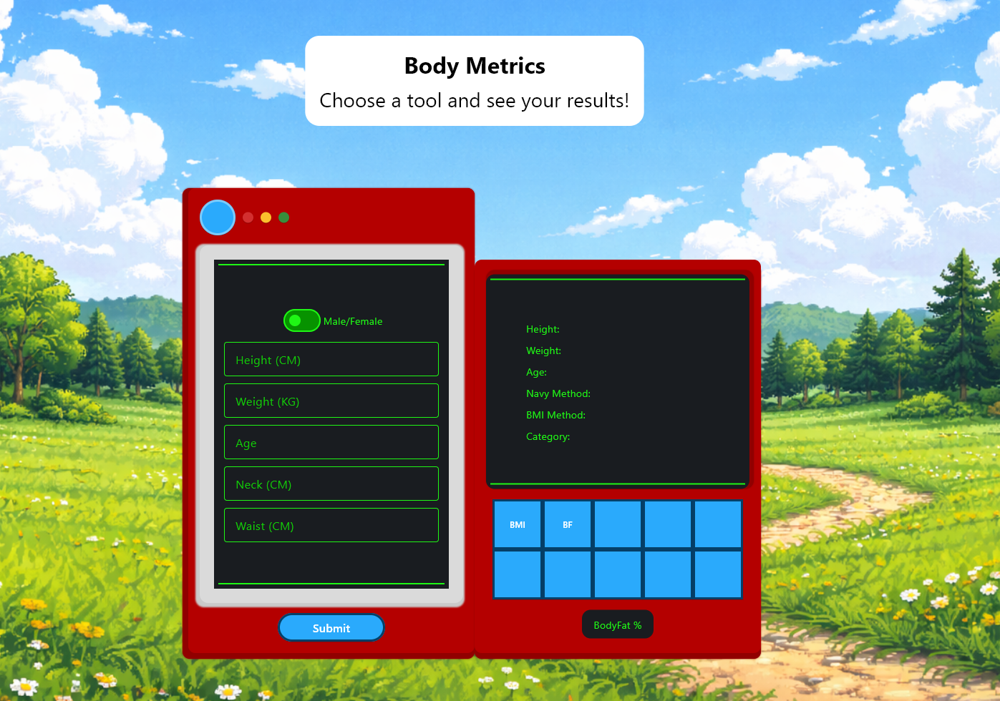

# Body Metrics



A simple health utility app built with **Python** that provides quick calculations and insights for basic health metrics.

The application presents tools as interactive cards, allowing users to easily access and calculate important health indicators through a clean and intuitive interface.

---

## Project Goals

This project was created to practice and demonstrate:

* UI development with Python
* Component-based architecture
* Interactive application design
* Health-related data calculations
* Scalable project structure for future features

---

## Features (Planned)

* Health tools displayed as interactive cards
* Expandable tools with detailed results
* Multiple health metric calculators
* Simple and intuitive user interface
* Future: health insights and recommendations

---

## Health Tools

| Tool | Description |
|------|------------|
| BMI (Body Mass Index) | Calculates body mass index based on height and weight to assess body weight category |
| (coming soon) | Add new tools as the project evolves |

---

## Tech Stack

* Python
* Flet (UI framework)

---

## Documentation

Project planning and architecture documents can be found in:

docs/

* discovery.md — project planning and feature definition
* architecture.md — system architecture and data flow

---

## Setup

Clone the repository:

```bash
git clone https://github.com/your-username/body-metrics.git
cd body-metrics
```

Install dependencies:

```bash
uv sync
```

Run the project:

```bash
flet run src/main.py
```
---

## Notes

This application is intended for educational purposes and should not be used as a substitute for professional medical advice.

---

## Status

Project currently in early development.